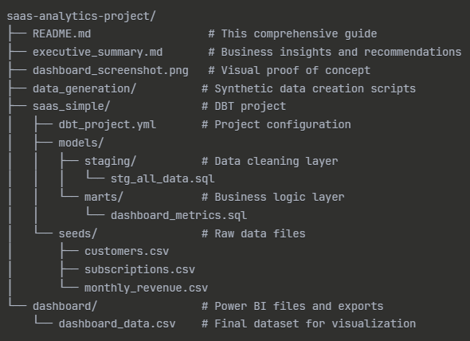

# SaaS-Analytics
A modern data pipeline approach to SaaS metrics tracking taking traditional Excel analysis to the next level with professional data tools.

## _Read the complete business analysis and recommendations in my portfolio._ 

# Project Origin Story
The Inspiration: Pennylane's Guides for their clients.
While exploring Pennylane's resources, I discovered they offer an Excel template to help their SME clients calculate churn and MRR, as a way to empower businesses with essential financial insights. 

This got me thinking: _What would the next evolution of this look like using professional data tools?_

I embarked on the Challenge: From Spreadsheet to Data Pipeline

Why? -> Excel templates are fantastic for getting started, but what if we could take this concept further? 

What if SME clients could have access to the same sophisticated analytics infrastructure that enterprise companies use? 
This project explores that vision by building a production-ready data pipeline for SaaS metrics analysis.

# The Technical Evolution

Pennylane's Approach: Excel template → Manual calculations → Basic insights

This Project's Approach: Raw data → DBT transformations → Automated dashboard → Advanced analytics

This isn't about replacing Pennylane's solution, it's about exploring what the next level could look like for anyone interested in advanced data analytics.

# Note: Data was AI-Generated 
Why Synthetic Data?
Because finding realistic SaaS datasets with customer lifecycle, subscription events, and financial metrics is nearly impossible due to privacy and competitive sensitivity.
The solution is to use AI-generated synthetic data that mimics real SaaS business patterns, including:

- Realistic customer acquisition curves
- Churn behavior patterns
- Subscription upgrade/downgrade flows
- Seasonal business variations

**Note:** The techniques, tools, and insights demonstrated are 100% applicable to real business data, only the source data is synthetic.

# Technical Architecture Guide
**Data Stack**

For data Transformation: DBT - Industry standard
Database: DuckDB
Visualization: Power BI Desktop to create enterprise-grade dashboards
Version Control: Git
Environment: Python/Anaconda (the later for environment creation)

Raw CSV Data → DBT Staging → DBT Marts → DuckDB → Power BI Dashboard

     ↓              ↓            ↓          ↓           ↓
  Messy data → Clean data → Business → Analytics → Executive
                                Logic     Ready     Insights

# Step 1:
If required, install data stack tools

`pip install dbt-duckdb`

# Step 2: Data 

Download the synthetic data that includes:

- customers.csv - Customer data with acquisition patterns
- subscriptions.csv - Subscription lifecycle events
- monthly_revenue.csv - Financial metrics

# Step 3: DBT Pipeline Development

Staging Layer -> to clean the data use the file `stg_all_data.sql`

Marts Layer -> for business logic implementation ranslating business requirements to SQL. Use file `dashboard_metrics.sql`

# Metrics calculation

`**customer_churn_rate =** (churned_customers / beginning_customers) * 100`

`**mrr_churn_rate =** (churned_mrr / previous_mrr) * 100`

`**arpu =** total_mrr / active_customers`

# Step 4: Power BI Dashboard Creation

Included dashboard Components:

- KPI Cards: Current performance metrics
- Trend Lines: Historical pattern analysis
- Executive Layout: Professional presentation format

# Project Structure

